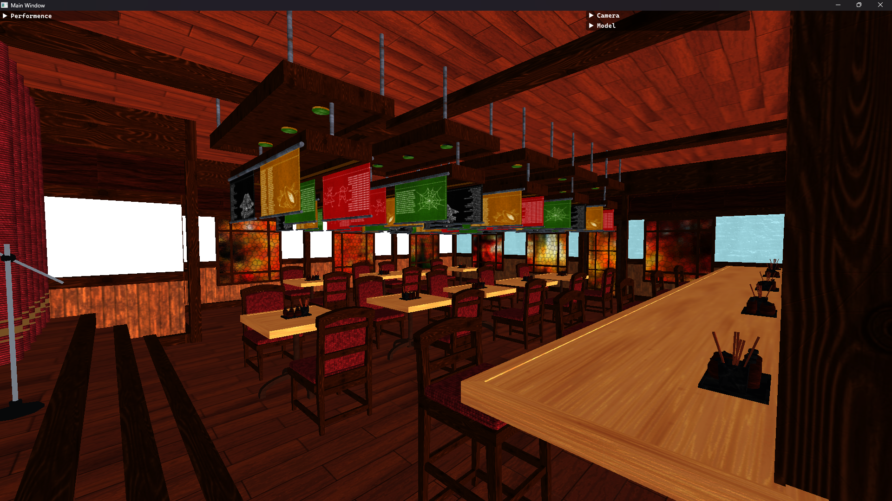
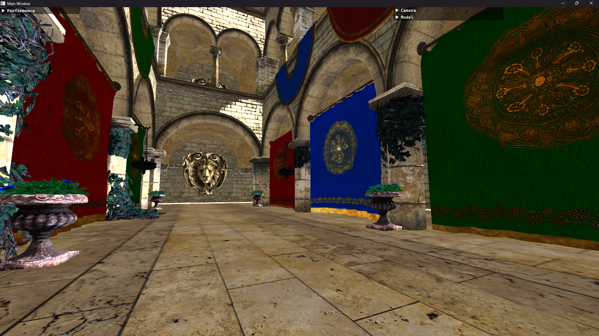
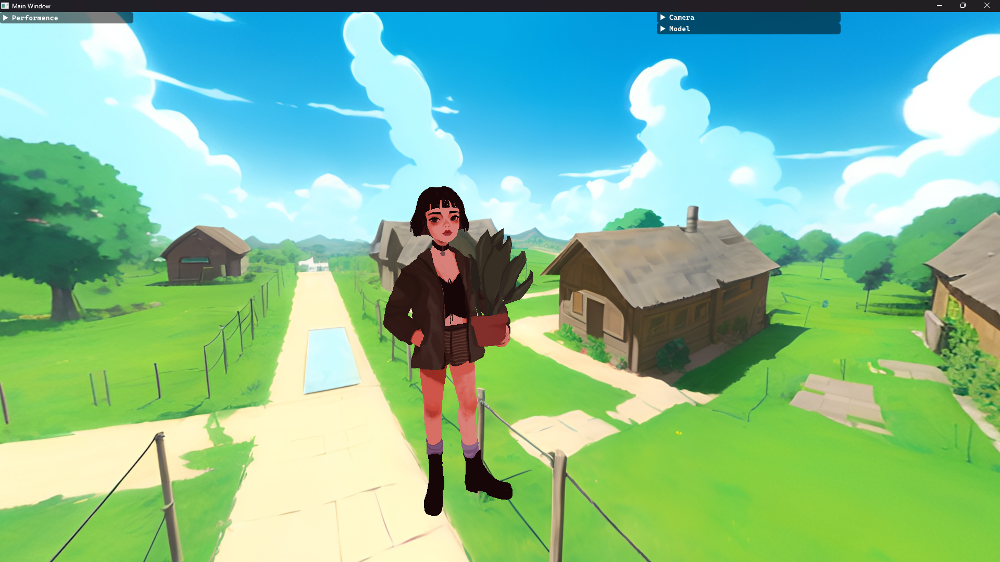
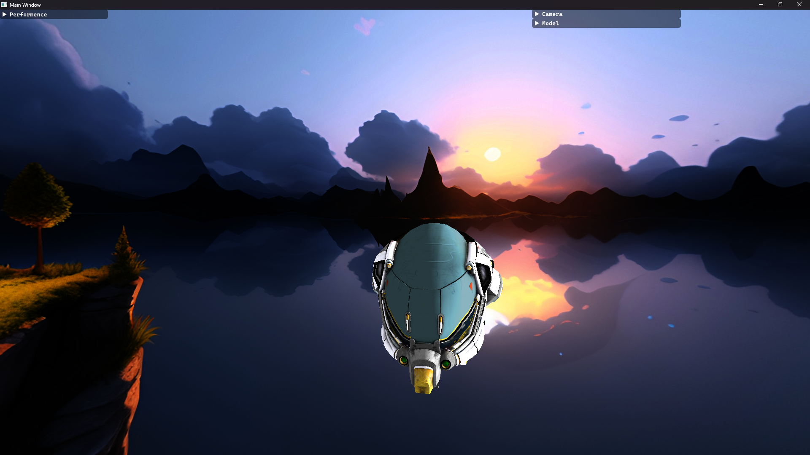

# DirectX 12 Rendering

###
Playground for learning graphics programming. 
Most of implemented solutions are either temporal or experimental. 
 
Currently working on Physically Based Rendering and Image-Based Lighting
###
### Build with: 
<ul>
<li> C++ 20 </li>
<li> DirectX 12 </li>
<li> Visual Studio 2022: MSVC, Windows SDK </li>
<li> vcpkg - via manifest mode </li>
</ul>

Third-party
<ul> 
<li>assimp</li>
<li>cgltf</li>
<li>tinygltf</li>
<li>DirectXTex</li>
<li>DirectXTK12</li>
<li>ImGui</li>
</ul>

#### Some screenshots

