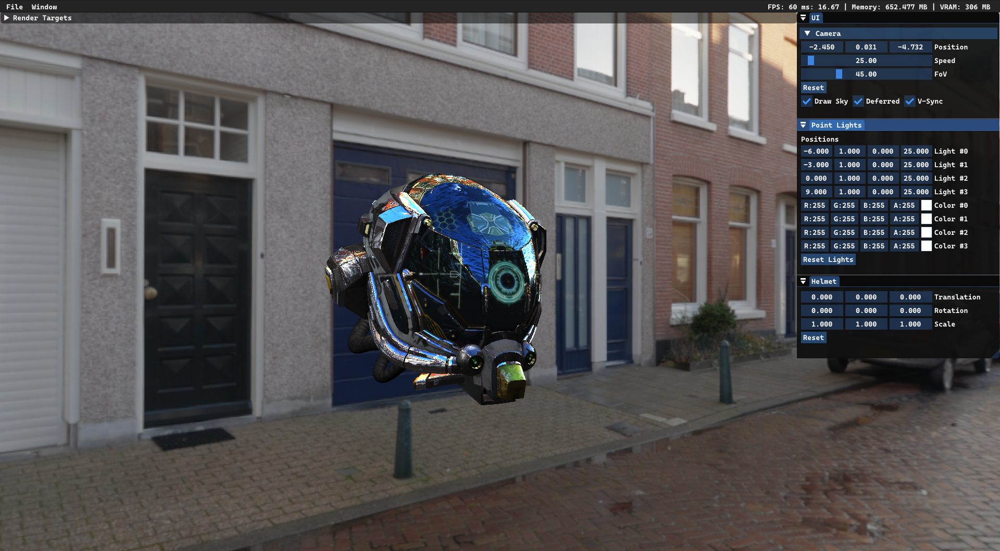

# DirectX 12 Rendering

###
Playground for learning graphics programming. 
Most of implemented solutions are either experimental or temporal. 
 
## Techniques: ##
- Deferred and Forward Rendering
- PBR with sky reflections
- Image Based Lighting
- Simple MipMapping via DirectXTex

### Built with: ###
<ul>
<li> C++ 20 </li>
<li> DirectX 12 </li>
<li> Visual Studio 2022: MSVC, Windows SDK </li>
<li> vcpkg - via manifest mode </li>
</ul>

### Third-party: ###
- [assimp](https://github.com/assimp/assimp)
- [imgui](https://github.com/ocornut/imgui)
- [spdlog](https://github.com/gabime/spdlog)
- [D3D12MemoryAllocator](https://github.com/GPUOpen-LibrariesAndSDKs/D3D12MemoryAllocator)
- [DirectXTex](https://github.com/microsoft/DirectXTex)
- [DirectXTK12](https://github.com/microsoft/DirectXTK12) -> WIC/DDS loaders

